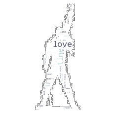

# Lyrics NLP
For this project I scrape data from www.metrolyrics.com from a selection of list_artists.
Then I used the scraped lyrics to build a Bayesian classifier
I used TfidfVectorizer, MultinomialNB, RandomOverSampler,and SMOTETomek and compare the results among them.
For fun I also created some WordClouds with generic shapes and also with the shape of several artists faces.

